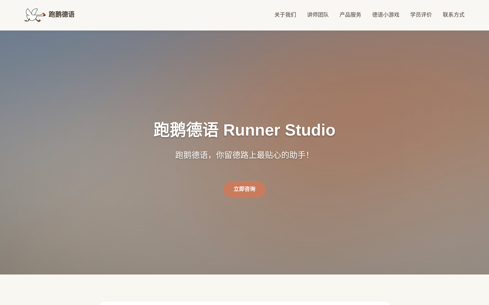
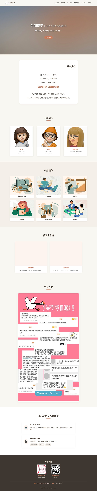
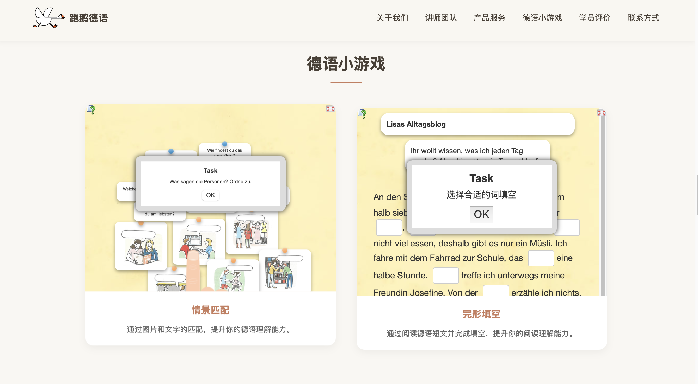
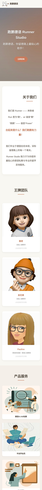
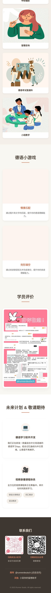

# Runner Studio — 跑鹅德语

Official one‑page website of **Runner Studio (跑鹅德语)**, a small tutoring studio that
teaches German to Chinese‑speaking learners and advises them on studying in Germany.

> 🇬🇧 [English](#english) · 🇩🇪 [Deutsch](#deutsch)



<details>
<summary>More screenshots · Weitere Screenshots</summary>

**Full page · Gesamte Seite**



**Embedded exercises · Eingebettete Übungen**



**Mobile · Mobil**

 

</details>

---

## English

### About the project

A hand‑crafted, single‑page marketing site for a German‑language tutoring studio.
The site introduces the studio and its teaching team, presents six service packages,
lets visitors try two interactive German exercises directly in the page, shows learner
feedback, and collects all contact channels in the footer.

The page is deliberately built as **one self‑contained `index.html` file** with no build
step, no framework and no external dependencies beyond two embedded exercise widgets.
For a site of this size that keeps hosting trivial (any static host works), load times
short, and the whole thing editable by a single person.

**Interface language:** Chinese (`lang="zh-CN"`) — the studio's audience are Chinese
native speakers learning German.

### Features

| Section | What it does |
| --- | --- |
| Sticky navigation | Translucent header with smooth in‑page scrolling to every section |
| Hero | Full‑bleed background image with a gradient overlay and a call‑to‑action button |
| About | The studio's name story (Run + ‑er → "跑鹅" → *Power*) and its mission |
| Team | Three teacher cards; clicking a card opens a modal with the teacher's academic background |
| Services | Six service tiles (1‑on‑1 tuition A1–B2, self‑study membership, university application support, study‑abroad consulting, exam prep, small‑group classes), each with a detail modal |
| German mini‑games | Two interactive exercises — a situational matching task and a cloze test — embedded from [LearningApps.org](https://learningapps.org) in responsive `<iframe>` wrappers |
| Reviews | Learner feedback |
| Roadmap | Planned German‑learning app and video course library, with clickable topic tags that open detail modals |
| Footer | QR codes for Xiaohongshu and WeChat, plus X (Twitter) and Xianyu links |

A single generic `openModal(img, title, desc)` function powers every modal on the page —
team cards, service tiles and roadmap tags all reuse it, which is why the whole script
block is under 20 lines.

### Tech stack

- **HTML5**, semantic sections with `id` anchors
- **CSS3**: custom properties for the design tokens, Flexbox and CSS Grid
  (`auto-fit` / `minmax` for team, service and game grids), `position: sticky`,
  `backdrop-filter`, keyframe animation for the modal, one mobile breakpoint at 768 px
- **Vanilla JavaScript** — no libraries, no bundler
- **Responsive**: fluid grids plus a `max-width: 768px` media query
- Static assets only (PNG/JPEG/ICO), served straight from the repository root

### Design

The visual concept, colour palette, typography and layout were all designed by me
before a single line of code was written. The palette is a warm, paper‑like scheme
meant to feel calm rather than "edtech loud":

| Token | Value | Use |
| --- | --- | --- |
| `--bg-color` | `#f9f7f2` | Page background (warm off‑white) |
| `--text-color` | `#4a4036` | Body text (soft dark brown) |
| `--accent-color` | `#c97c5d` | Terracotta accent: buttons, headings, hover states |
| `--card-bg` | `#ffffff` | Cards |
| `--footer-bg` | `#3e3630` | Footer |
| `--footer-text` | `#e8e0d5` | Footer text |

Recurring interaction pattern: cards lift on hover (`translateY`) and every clickable
element reveals more content in the same modal component, so visitors learn the
interaction once and can apply it everywhere on the page.

### Images

All images are either drawn by me or sourced from royalty‑free image libraries.
Team photos and QR codes belong to Runner Studio.

### Development notes

The concept, information architecture, layout, colour scheme and all content decisions
are mine. The HTML/CSS implementation was written with the help of a large language
model ("vibe coding"): I specified each section, reviewed the generated markup, and
iterated on spacing, responsive behaviour and interaction details until the result
matched the design I had in mind.

Working this way taught me the practical lesson that the quality of the output depends
almost entirely on the precision of the specification, and that generated code still
has to be read, tested in the browser and reworked before it is good enough to ship.

### Running it locally

```bash
git clone https://github.com/whks-wu/runner-studio.git
cd runner-studio
# just open the file …
open index.html
# … or serve it, so the embedded exercises behave exactly as in production
python3 -m http.server 8000   # → http://localhost:8000
```

Deployment: copy the repository contents to any static host (GitHub Pages, Netlify,
Vercel, or plain web space). There is nothing to build.

### Project structure

```
runner-studio/
├── index.html          # the entire site: markup, styles and script
├── logo-studio.png     # studio logo
├── main-bg.jpg         # hero background
├── team-*.png/.jpeg    # teacher portraits
├── product1–6.png      # service tiles
├── text/word/grammar.png  # roadmap topic images
├── comment.JPG         # learner feedback
├── *-qrcode.*          # Xiaohongshu / WeChat QR codes
└── favicon*            # favicons
```

### Credits & licence

The two interactive exercises are hosted by **LearningApps.org** and embedded via
`<iframe>`; they remain the property of their respective authors.
All other content — text, design and images — © Runner Studio. Please do not reuse the
branding, photos or copy without permission.

---

## Deutsch

### Über das Projekt

Die Website von **Runner Studio (跑鹅德语)**, einem kleinen Studio, das
chinesischsprachigen Lernenden Deutsch beibringt und sie beim Studium in Deutschland
berät. Die One‑Page‑Site stellt das Studio und das Lehrteam vor, präsentiert sechs
Angebote, lässt Besucherinnen und Besucher zwei interaktive Deutschübungen direkt auf
der Seite ausprobieren, zeigt Teilnehmerstimmen und bündelt alle Kontaktkanäle im Footer.

Die Seite besteht bewusst aus **einer einzigen, in sich geschlossenen `index.html`** —
ohne Build‑Prozess, ohne Framework und ohne externe Abhängigkeiten außer den beiden
eingebetteten Übungs‑Widgets. Für ein Projekt dieser Größe bleibt das Hosting damit
trivial, die Ladezeit kurz und die Seite von einer Person wartbar.

**Sprache der Oberfläche:** Chinesisch (`lang="zh-CN"`) — die Zielgruppe des Studios
sind chinesische Muttersprachler, die Deutsch lernen.

### Funktionen

| Bereich | Beschreibung |
| --- | --- |
| Sticky‑Navigation | Halbtransparenter Header mit weichem Scrollen zu allen Abschnitten |
| Hero | Vollflächiges Hintergrundbild mit Farbverlauf‑Overlay und Call‑to‑Action |
| Über uns | Die Namensgeschichte (Run + ‑er → „跑鹅" → *Power*) und das Selbstverständnis des Studios |
| Team | Drei Lehrkräfte‑Karten; ein Klick öffnet ein Modal mit dem akademischen Werdegang |
| Angebote | Sechs Kacheln (Einzelunterricht A1–B2, Selbstlern‑Mitgliedschaft, Bewerbungshilfe, Studienberatung, Prüfungsvorbereitung, Kleingruppen), jeweils mit Detail‑Modal |
| Deutsch‑Minispiele | Zwei interaktive Übungen — Zuordnungsaufgabe und Lückentext — von [LearningApps.org](https://learningapps.org) in responsiven `<iframe>`‑Containern eingebettet |
| Bewertungen | Rückmeldungen von Lernenden |
| Ausblick | Geplante Lern‑App und Videokursbibliothek, mit klickbaren Themen‑Tags |
| Footer | QR‑Codes für Xiaohongshu und WeChat sowie Links zu X (Twitter) und Xianyu |

Sämtliche Modals der Seite laufen über eine einzige generische Funktion
`openModal(img, title, desc)` — Teamkarten, Angebotskacheln und Themen‑Tags nutzen sie
gemeinsam. Deshalb kommt die gesamte Seite mit unter 20 Zeilen JavaScript aus.

### Technologie

- **HTML5**, semantische Abschnitte mit `id`‑Ankern
- **CSS3**: Custom Properties als Design‑Tokens, Flexbox und CSS Grid
  (`auto-fit` / `minmax` für Team‑, Angebots‑ und Spielraster), `position: sticky`,
  `backdrop-filter`, Keyframe‑Animation für das Modal, ein mobiler Breakpoint bei 768 px
- **Vanilla JavaScript** — keine Bibliotheken, kein Bundler
- **Responsiv**: fließende Raster plus Media Query bei `max-width: 768px`
- Ausschließlich statische Assets (PNG/JPEG/ICO) direkt aus dem Repository‑Root

### Gestaltung

Gestaltungskonzept, Farbklima, Typografie und Layout stammen vollständig von mir und
standen fest, bevor die erste Zeile Code entstand. Die Palette ist bewusst warm und
papierhaft gehalten — ruhig statt grell:

| Token | Wert | Verwendung |
| --- | --- | --- |
| `--bg-color` | `#f9f7f2` | Seitenhintergrund (warmes Off‑White) |
| `--text-color` | `#4a4036` | Fließtext (weiches Dunkelbraun) |
| `--accent-color` | `#c97c5d` | Terrakotta‑Akzent: Buttons, Überschriften, Hover |
| `--card-bg` | `#ffffff` | Karten |
| `--footer-bg` | `#3e3630` | Footer |
| `--footer-text` | `#e8e0d5` | Footer‑Text |

Wiederkehrendes Interaktionsmuster: Karten heben sich beim Hover leicht an
(`translateY`), und jedes klickbare Element zeigt weitere Inhalte in derselben
Modal‑Komponente. Das Interaktionsprinzip muss so nur einmal verstanden werden und
gilt dann auf der ganzen Seite.

### Bilder

Alle Bilder habe ich entweder selbst gezeichnet oder aus lizenzfreien Bilddatenbanken
bezogen. Teamfotos und QR‑Codes gehören Runner Studio.

### Anmerkungen zur Entwicklung

Konzept, Informationsarchitektur, Layout, Farbschema und sämtliche inhaltlichen
Entscheidungen stammen von mir. Die HTML/CSS‑Umsetzung ist mithilfe eines Large
Language Models entstanden („Vibe Coding"): Ich habe jeden Abschnitt spezifiziert, das
generierte Markup geprüft und Abstände, responsives Verhalten und Interaktionsdetails
so lange überarbeitet, bis das Ergebnis meinem Entwurf entsprach.

Die praktische Lehre daraus: Die Qualität des Ergebnisses hängt fast vollständig an der
Präzision der Spezifikation — und generierter Code muss trotzdem gelesen, im Browser
getestet und überarbeitet werden, bevor er veröffentlichungsreif ist.

### Lokal ausführen

```bash
git clone https://github.com/whks-wu/runner-studio.git
cd runner-studio
# Datei einfach öffnen …
open index.html
# … oder ausliefern, damit sich die eingebetteten Übungen wie in Produktion verhalten
python3 -m http.server 8000   # → http://localhost:8000
```

Deployment: Repository‑Inhalt auf einen beliebigen Static Host kopieren (GitHub Pages,
Netlify, Vercel oder klassischer Webspace). Es gibt nichts zu bauen.

### Projektstruktur

```
runner-studio/
├── index.html          # die komplette Seite: Markup, Styles und Skript
├── logo-studio.png     # Studio‑Logo
├── main-bg.jpg         # Hero‑Hintergrund
├── team-*.png/.jpeg    # Porträts der Lehrkräfte
├── product1–6.png      # Angebotskacheln
├── text/word/grammar.png  # Bilder zu den geplanten Themen
├── comment.JPG         # Teilnehmerstimmen
├── *-qrcode.*          # Xiaohongshu‑/WeChat‑QR‑Codes
└── favicon*            # Favicons
```

### Nachweise & Lizenz

Die beiden interaktiven Übungen werden von **LearningApps.org** gehostet und per
`<iframe>` eingebunden; die Rechte liegen bei den jeweiligen Autorinnen und Autoren.
Alle übrigen Inhalte — Texte, Gestaltung und Bilder — © Runner Studio. Bitte Branding,
Fotos und Texte nicht ohne Erlaubnis weiterverwenden.
